<!-- Generated by GitHub Profile Agent Console. Edit profile.config.json, then run npm run generate. -->
<p align="center">
  <picture>
    <source media="(max-width: 760px) and (prefers-color-scheme: dark)" srcset="./assets/hero/agent-console-a4bbc1e5-mobile-dark.svg">
    <source media="(max-width: 760px)" srcset="./assets/hero/agent-console-a4bbc1e5-mobile-light.svg">
    <source media="(prefers-color-scheme: dark)" srcset="./assets/hero/agent-console-a4bbc1e5-dark.svg">
    <source media="(prefers-color-scheme: light)" srcset="./assets/hero/agent-console-a4bbc1e5-light.svg">
    
  </picture>
</p>

<p align="center">
  <a href="https://github.com/ronaldlehot"></a>
  <a href="https://instagram.com/ronaldlehot"></a>
</p>

<p align="center">
  
</p>

## 👤 About Me

```js
const ronaldo = {
  name: "Fransisco Ronaldo Lehot",
  role: "Web Developer",
  from: "Kupang, NTT, Indonesia",
  education: "B.Sc. Computer Science, Universitas Nusa Cendana (2024)",
  currentlyBuilding: ["Satu Data NTT", "Dashboard Pimpinan"],
  currentlyLearning: "new frameworks & languages",
  askMeAbout: ["Web Dev", "APIs", "Databases", "anything tech"],
  reachMe: {
    email: "ronaldlehot@gmail.com",
    instagram: "@ronaldlehot",
  },
};
```

## 🐍 Contribution Snake

<p align="center">
  <picture>
    <source media="(prefers-color-scheme: dark)" srcset="https://raw.githubusercontent.com/ronaldlehot/ronaldlehot/output/github-contribution-grid-snake-dark.svg">
    <source media="(prefers-color-scheme: light)" srcset="https://raw.githubusercontent.com/ronaldlehot/ronaldlehot/output/github-contribution-grid-snake.svg">
    
  </picture>
</p>


## Recent Activity

<!-- AUTO:ACTIVITY:START -->
_Recent public activity will appear here after the workflow runs._
<!-- AUTO:ACTIVITY:END -->

---

<p align="center">
  Building thoughtful web apps and sharing what works.
</p>
